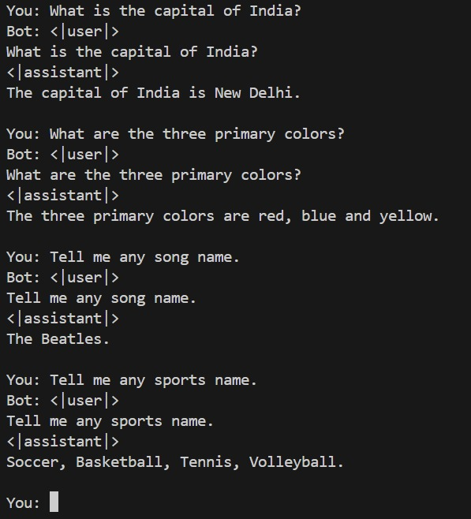

# LLM from Scratch

---

## Project Overview

This project is a step-by-step, hands-on journey into the world of Large Language Models (LLMs).  
I started with the core theory and mechanics (tokenization, attention, transformer blocks), practiced with raw data, then gradually moved to building a full instruction-tuned chatbot using both self-built and public data—culminating in a real, interactive chatbot demo.

---

## Learning Journey

### 1. Foundational Practice: Text Processing & Transformers
- Learned to tokenize raw text, handle whitespace and punctuation, and prepare data for LLMs.
- Implemented and visualized attention mechanisms in `attention.ipynb`—understanding how transformers "focus" on parts of text.
- Built every major component: embeddings, positional encodings, multi-head attention, layer normalization, and feedforward blocks.

### 2. Custom Data & Scratch Models
- Created a small, custom instruction-following dataset (`instruction-data.json`).
- Designed a simple chat corpus format using role tokens: `<|user|>`, `<|assistant|>`, `<|end|>`.
- Trained a GPT-like transformer from scratch using my own data and architecture (`training.ipynb`).
- Observed first-hand the limits of tiny datasets and the difference between memorization and generalization.

### 3. Loading and Using Pretrained LLMs
- Learned to load GPT-2 weights using PyTorch (with `gpt.py` and `prev.py`).
- Practiced finetuning with my custom dataset to make a small “instruct-style” chatbot (`finetuning.ipynb`).
- Experimented with batch size, learning rate, model depth, and context length.

### 4. Scaling Up with Real Data (Alpaca)
- Preprocessed the full open-source Alpaca dataset (`alpaca_data.json`) into my chat role-token format.
- Wrote a script to convert instruction data into model-ready prompts.
- Finetuned GPT-2 on this much larger and more diverse data, seeing dramatic improvements in chatbot ability.

### 6. Inference, Chat Loop, and Output Extraction
- Built an interactive chatbot for real-time dialogue (`generate.ipynb`).
- Developed code to extract only the assistant’s reply (avoiding echoed prompts/role tokens).
- Evaluated the chatbot on various tasks (grammar, spelling, Q&A).

---

## Project Structure

| File/Notebook        | Purpose                                  |
|----------------------|------------------------------------------|
| `text.ipynb`         | Tokenization & raw data practice         |
| `attention.ipynb`    | Building/testing attention mechanisms    |
| `generate.ipynb`     | Inference/chatbot demo                   |
| `training.ipynb`     | Train LLM from scratch                   |
| `finetuning.ipynb`   | Finetune GPT-2 on custom/instruct data   |
| `prev.py`, `gpt.py`  | Core model code, GPT-2 loader            |
| `instruction-data.json` | Small custom dataset                  |
| `alpaca_data.json`   | Large, real instruction dataset          |
| `chat_corpus.txt`    | Model-ready chat data                    |

## Example Chatbot Output

